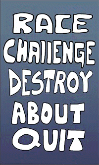
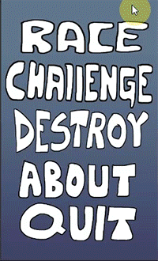
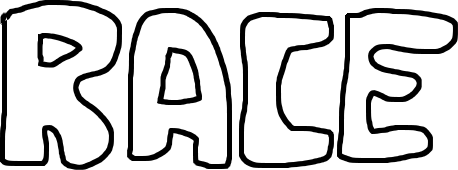

# 2D Racer Game Using Unity Overview

This 2D Unity Racer game is based on the tutorial online. The overall game mechanishm is simple where it relies on left and right arrow maneuver to avoid incoming cars. There are 3 game mode namely, "race", "challenge" and destroy. Through the tutorials, I have learnt to implement simple collision detection, delay start timers, audio management, respawn, game menus and 2D sprite animation. At the end are some of the sources which I have used to learn the skills necessary to build this game.

## Game Modes

1. **Race Mode:** With only 1 life, objective is to survive as long as possible. 

2. **Challenge Mode:** Given 1 minute, avoid as many cars as possible.

3. **Destroy Mode:** Have fun and enjoy the explosion!

## Tips on Creating Simple Buttons in Photoshop (Freestyle)

1. Start with a new file
1. Make the background
1. Create a new layer
1. Drawing the button
	1. On the new layer, Use the lasso tool. Draw each letter. 
	1. Use paint bucket tool (foreground:white) to color each letter white.
1. Adding Black Border
	1. Use Quick Select tool to select the text.
	1. Go to Toolbar -> Select -> Modify -> Expand (5px).
	1. Use Paint Bucket Tool (background:black), color the outline.
1. Make the background transparent
1. Crop
1. File -> save for web -> png24 (for the transparent background)
1. DONE

## Explosion Animation

The following explosion animation was made using photoshop. The settings are as follows:
- **Colors** : *#ff993e*, *#ff7800*, *#ff4800*, *#ffcc00*, *#4e4336*. 
- **Canvas Size** : 400px x 400px 

## Credits

- **Charger Games**
	- [2D Unity Race Tutorial](https://www.youtube.com/watch?v=r7J-wiJGK1w&index=1&list=PLytjVIyAOStpcOGg6HIHhnnOZAdxkAr1U)
- **Alexander Zotov**
	- [Count Down with Delay Start Tutorial](https://www.youtube.com/watch?v=3MlauoiahvI)
- **Sujit Yadav**
	- [Topdown Car Game Sprite](http://unluckystudio.com/game-art-giveaway-7-top-down-vehicles-sprites-pack/)
- **Blackthornpod**
	- [Using Sprite Sheet in Unity](https://www.youtube.com/watch?v=ou8VkQB2sos)
	- [Simple Menu in Unity](https://www.youtube.com/watch?v=VXK1KMDAldo)
- **Pixelelement Games**
	- [Explosion Animation and Collision Detection](https://www.youtube.com/watch?v=iTHEXMF0hpc)
- **Jaysen Batchelor**
	- [Create Explosion Animation in Photoshop](https://www.youtube.com/watch?v=VMXEXVrX2tw)
- **Jertlok**
	- [3-2-1...Go Race Audio](https://www.youtube.com/watch?v=SuzKmKapAmM)
